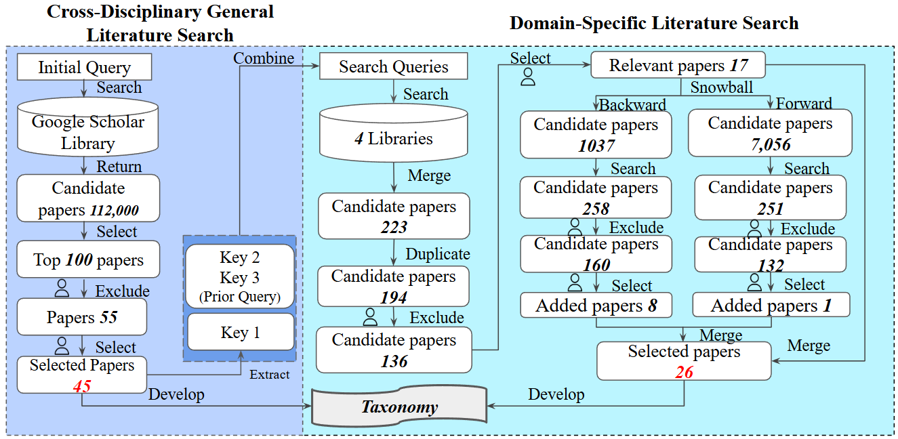

## Files with **prefix "appendix"** are materials about the literature review:

**appendix - general search list.csv:** 100 papers of general search.

**appendix - relevant paper 45 (general).csv:** 45 relevant papers from general search. Containing labeled dimensions, and relevant phases indicating the dimensions. 

**appendix - specific search list.csv:** 194 papers from specific search. If you filter out those with exclude=1, you will get 136 candidate paper. If you check those with selected=1, you will get 17 relevant papers where we snowball on.

**appendix - snowball backward (after searching).csv:** 258 papers got by searching keywords on 1037 candidate papers from backward snowballing. If you filter out those with exclude=1, you will get 160 candidate paper. If you check those with selected=1, you will get 8 relevant papers.

**appendix - snowball backward (after searching).csv:** 251 papers got by searching keywords on 7056 candidate papers from forward snowballing. If you filter out those with exclude=1, you will get 132 candidate paper. If you check those with selected=1, you will get 1 relevant papers.

**appendix - relevant paper 26 (specific).csv:** 26 relevant papers from 17 (specific search) + 8 (backward snowballing) + 1 (forward snowballing). Containing labeled dimensions, and relevant phases indicating the dimensions. 

**appendix - taxonomy and citations.csv:** complete list of references for each aspect under the dimensions.

## **"survey (anonymized for review).pdf"**: 

The complete survey we sent to participants.

## Files with **prefix "appendix2"** are materials about the survey results:

**appendix2 - survey results.csv:** The complete and valid 32 survey responses.

**appendix2 - open-ended questions.csv:** The answers for 6 open-ended questions and our labels.

**appendix2 - relevance.csv:** The data for Figure 3 (Relevance of Dimension in Defining ES-CodeGen) in the paper.

**appendix2 - stages and artifacts.csv:** The data for Figure 4 (Dimensions and their applicable stages) and Figure 5 (Dimensions and their applicable artifacts) in the paper. Note that in the figure, we proportionally scale responses so that the selected options in each row sum to 100%. However, the data provided here are unscaled: each cell shows the percentage of participants who selected that specific stage (or artifact) for the corresponding dimension.

**appendix2 - acceptable trade-offs.csv:** The specific analytic data for Figure 6 (To what extent trade-offs are considered acceptable) in the paper.

## **"figures" folder:**
Contains the workflow of our literature review (as shown above) and Figures 3 to 6.

