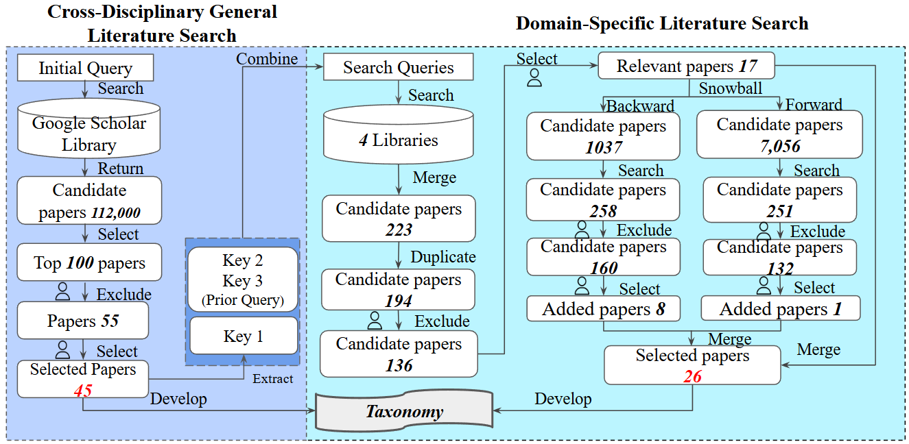

## Files in folder **"Appendix1-Literature-Review"** are materials about the literature review:

**appendix - general search list.csv:** 100 papers from Cross-disciplinary General Literature Search. If you filter out those with exclude=1, you will get 55 candidate papers. If you check those with selected=1, you will get 45 relevant papers. We also put the related dimensions and phases for the 45 selected paper so that you can check where each dimension first appeared. Among the 100 papers, we found that after reading the top 51 papers, no new dimensions emerged.

**appendix - relevant paper 45 (general).csv:** 45 relevant papers from Cross-disciplinary General Literature Search. It contains labeled domains, dimensions, and relevant phases indicating the dimensions. 

**appendix - specific search list.csv:** 194 papers from Domain-Specific Literature Search. If you filter out those with exclude=1, you will get 136 candidate papers. If you check those with selected=1, you will get 17 relevant papers where we snowballed on.

**appendix - snowball backward (after searching).csv:** 258 papers got by searching keywords on 1037 candidate papers from backward snowballing. If you filter out those with exclude=1, you will get 160 candidate papers. If you check those with selected=1, you will get 8 relevant papers. It also contains a column "snowballing source title" indicating where each paper is snowballed from.

**appendix - snowball backward (after searching).csv:** 251 papers got by searching keywords on 7056 candidate papers from forward snowballing. If you filter out those with exclude=1, you will get 132 candidate papers. If you check those with selected=1, you will get 1 relevant paper. It also contains a column "snowballing source title" indicating where each paper is snowballed from.

**appendix - relevant paper 26 (specific).csv:** 26 relevant papers from 17 (specific search) + 8 (backward snowballing) + 1 (forward snowballing). It contains labeled dimensions, and relevant phases indicating the dimensions. 

**appendix - taxonomy and citations.csv:** complete list of references for each aspect under the dimensions. We also added a column ``first appeared in which general paper''.

## **"survey (anonymized for review).pdf"**: 

The complete survey we sent to participants.

## Files in folder **"Appendix2-Survey"** are materials about the survey results:

**appendix2 - survey results.csv:** The complete and valid 32 survey responses.

**appendix2 - open-ended questions.csv:** The answers for 6 open-ended questions and our labels.

**appendix2 - relevance.csv:** The data for Figure 3 (Relevance of Dimension in Defining ES-CodeGen) in the paper.

**appendix2 - stages and artifacts.csv:** The data for Figure 4 (Dimensions and their applicable stages) and Figure 5 (Dimensions and their applicable artifacts) in the paper. Note that in the figure, we proportionally scale responses so that the selected options in each row sum to 100%. However, the data provided here are unscaled: each cell shows the percentage of participants who selected that specific stage (or artifact) for the corresponding dimension.

**appendix2 - acceptable trade-offs.csv:** The specific analytic data for Figure 6 (To what extent trade-offs are considered acceptable) in the paper.

**appendix2 - post-survey data.csv:** The analytic data for post-survey questions (whether the survey improved their understanding of ES-CODEGEN, whether the survey made them feel that the ethical sourcing issues are more important, generalizability of our definition(dimensions), and the dimensions they tended to ignore).

## **"figures" folder:**
Contains Figures 1 to 4 shown in our paper. Figure 2 shown above is the workflow of our literature review.

